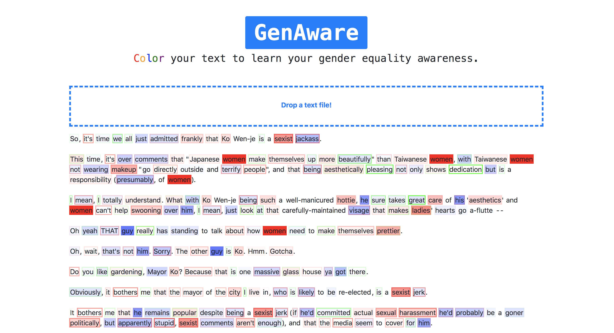

# GenAware



A tool for scoring and visualizing the gender-oriented words and their sentiments in a piece of text.

Helps to raise gender equality awareness. Be aware not to contain these patterns in your text:

- `(female / male) should ...`
- `(female / male) is generally (positive / negative)`
- `A (positive / negative) (female / male) ...`

## Usage

```bash
# Setup environment
$ conda env create -f environment.yml
$ conda activate gender-equ

# Run app server
$ python -m project.src.app

# Or, interactively test word gender and sentiment scores
$ python -m project.src.score
>>> Enter word (or 'q' to exit): <word>
>>> Gender: <gender score>, sent: <sentiment score>
```

## Scoring Mechanism

The gender and sentiment scores are based on cosine distance of the word to a pre-compiled list of words among each category.

For example, a pre-compiled list of female words are: 'female', 'women', 'woman', 'girl', and a pre-compiled list of male words are: 'male', 'men', 'man', 'boy'. The average cosine distance of a query word to these words is computed. The final gender score is `male_score - female_score`.

- Gender score range: `[-1, 1]`, negative: male, positive: female
- Sentiment score range: `[-1, 1]`, negative: negative, positive: positive

## Coloring Mechanism

- Gender
  - Blue: male, red: female
  - Background color
- Sentiment
  - Green: positive, red: negative
  - Border color
